# Infraestructura de 3 Niveles en AWS
Infraestructura en 3 niveles: un balanceador, un cluster de dos servidores web, un servidor NFS, y un servidor de base de datos.

## Índice

* [1. Arquitectura](#1-arquitectura)
* [2. Script de Aprovisionamiento](#2-script-de-aprovisionamiento)
  * [2.1 Base de Datos](#21-base-de-datos)
  * [2.2 NFS](#22-nfs)
  * [2.3 Web](#23-web)
  * [2.4 Balanceador](#24-balanceador)
* [3. Configuración en AWS](#3-configuración-en-aws)
  * [3.1 Crear la VPC](#31-crear-la-vpc)
  * [3.2 Crear las subredes](#32-crear-las-subredes)
  * [3.3 Configurar el Internet Gateway y Rutas](#33-configurar-el-internet-gateway-y-rutas)
  * [3.4 Configurar ACLs](#34-configurar-acls)
  * [3.5 Configurar grupos de seguridad](#35-configurar-grupos-de-seguridad)
  * [3.6 Crear las instancias](#36-crear-las-instancias)
  * [3.7 Acceso público](#37-acceso-público)
* [4. Comprobación y Uso](#4-comprobación-y-uso)
* [5. Conclusión](#5-conclusión)

---

## 1\. Arquitectura.

La infraestructura se distribuye en cinco máquinas virtuales, creando capas de aislamiento esenciales para la alta disponibilidad y la seguridad.

| Máquina | Función | IP |
| --- | --- | --- |
| **BalanceadorCrisAlm** | Balanceador | `192.168.10.5` |
| **ServerWeb1CrisAlm** | Servidor Web | `192.168.10.10` `192.168.20.10` |
| **ServerWeb2CrisAlm** | Servidor Web | `192.168.10.20` `192.168.20.20`|
| **NFSCrisAlm** | Servidor NFS | `192.168.10.30` `192.168.20.30` |
| **BDCrisAlm** | Servidor de Base de Datos | `192.168.20.50` |
 
El tráfico se gestiona mediante dos subredes:

* Subred WWW: utilizada por el balanceador y los servidores web servidos por el NFS.
* Subred BD: utlizada por los servidores web y la base de datos para gestionar las peticiones MySQL.

El balanceador tendrá también una IP pública que se asociará a un dominio, permitiendo el acceso desde Internet.

-----
    
## 2\. Script de Aprovisionamiento.

Cada instancia tendrá un script de aprovisionamiento para facilitar su configuración.

### 2.1\. Base de Datos.

El script de la BD realiza las siguientes configuraciones:

* Establece el hostname.
* Instala MariaDB.
* Configura el servicio para escuchar en todas las interfaces (`bind-address = 0.0.0.0`).

* Crea la base de datos y un usuario con privilegios.

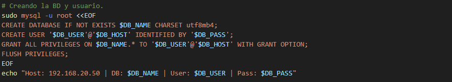

### 2.2\. NFS.

El script del servidor NFS (NFSCrisAlm) prepara el directorio compartido y configura WordPress para la DB remota.

* Establece el hostname y el directorio de WordPress.
* Instala NFS Kernel Server.
* Descarga y descomprime WordPress.
  

* Configura `wp-config.php`, apuntando al servidor DB: `DB_HOST: 192.168.20.50`.

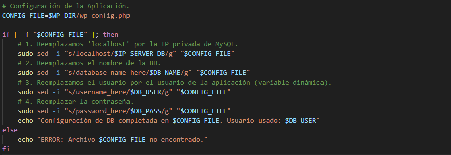

* Exporta el directorio de WordPress permitiendo el acceso solo a la subred de servidores web.

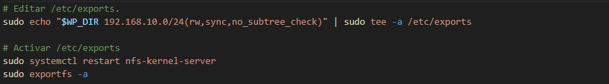

### 2.3\. Web.

El script de los servidores web, el mismo para ambos, realiza la configuración de la aplicación y el cifrado SSL.

* Establece el hostname.
* Instala Apache2, PHP y el cliente NFS.
* Monta el recurso compartido NFS en `/var/www/html` y asegura la persistencia en `fstab` (para que no se desmonte al reiniciar la instancia).
* Ejecuta `wp core install` con `wp-cli` para inicializar las tablas de la DB.

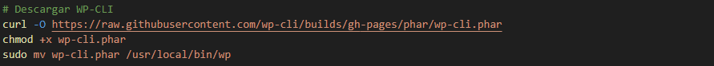
  
* Personaliza la página de inicio.
* Genera un certificado autofirmado.

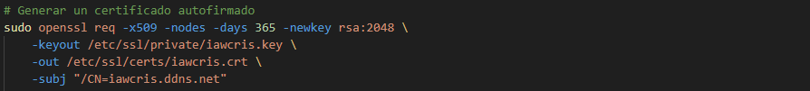
 
* Configura HTTP (en caso de que el HTTPS falle) y HTTPS (puerto 443).

### 2.4\. Balanceador.

El script del Balanceador (BalanceadorCrisAlm) maneja el tráfico público y el proxy interno.

* Establece el hostname.
* Instala Apache2 y los módulos de proxy y SSL.
* Configura en el puerto 80 la redirección a HTTPS.

  
* Configura en el puerto 444 el SSL y el balanceo.

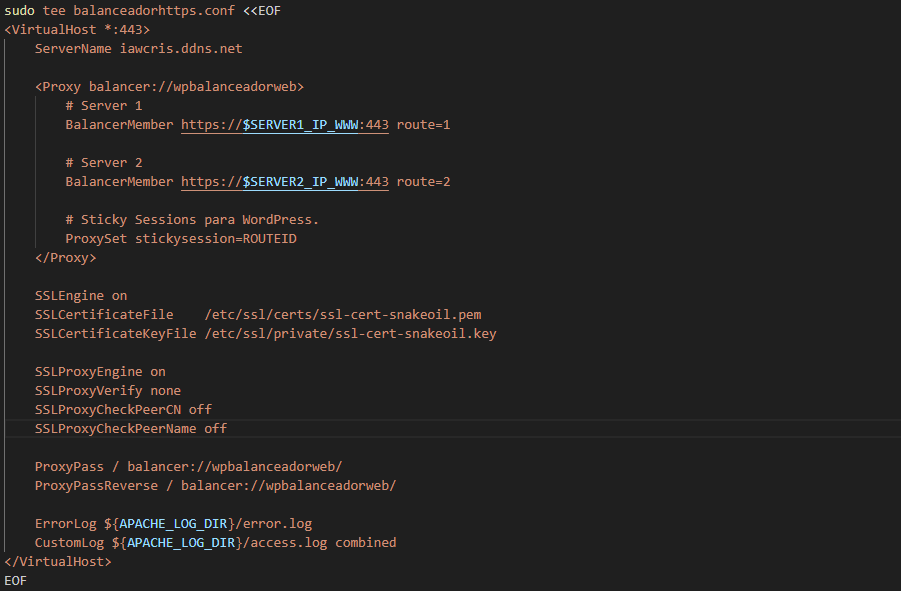

-----

## 3\. Configuración en AWS.

### 3.1\. Crear la VPC.

Una VPC (Virtual Private Cloud) es una red privada dentro de AWS.

Se le asigna un nombre y un bloque CIDR IPv4 (una dirección de red con su máscara).

### 3.2\. Crear las subredes.

Se crean tres subredes: una pública y dos privadas, garantizando que las IPs fijas estén dentro de los rangos.

A cada subred, se le asignan los siguientes parámetros: un nombre, una zona de disponibilidad (si se quiere asignar una en concreto) y un bloque CIDR IPv4. 

### 3.3\. Configurar el Internet Gateway y Rutas.

Puertas de Enlace a Internet: se crea un IGW (Internet Gateway) para permitir la comunicación de la VPC con Internet. Se le asigna un nombre y, una vez creado, se asocia a la VPC.

 

A las rutas, que se crean en Tablas de enrutamiento, se les da un nombre y se selecciona la VPC. 

Una vez creada, se asocia a una subred (Editar asociaciones). También, en el caso de la subred pública, se añade la ruta hacia la puerta de enlace (Editar rutas). Las subredes privadas no tendrán salida a Internet.

### 3.4\. Configurar ACLs.

Un ACL actúa como un firewall que actúa sobre la subred, controlando el tráfico que entra y sale. Se configura ACL sin estado en la subred pública. El ACL de las subredes privadas niegan cualquier tráfico de entrada que no provenga de la red interna. 

Para ello, se modifican las entradas cambiando los parámetros regla, puerto, origen y accción. Se añade lo mismo en las reglas de salida o destino.

### 3.5\. Configurar grupos de seguridad.

Un grupo de seguridad actúa como un firewall que actúa sobre una instancia.

Hay que permitir HTTP, HTTPS y SSH para el balanceador y los servidores web y NFS. En el servidor de base de datos hay que tener más precauciones; por ejemplo, el tráfico por el puerto 3306 (de MySQL) que solo puede provenir de los servidores web y NFS.

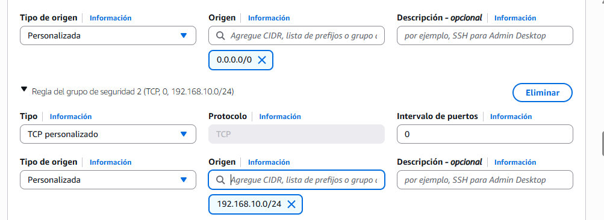

### 3.6\. Crear las instancias.

Desde EC2, se lanza una instancia. Se le asignan nombre, imagen (Debian, en este caso) y tipo (el que viene por defecto).

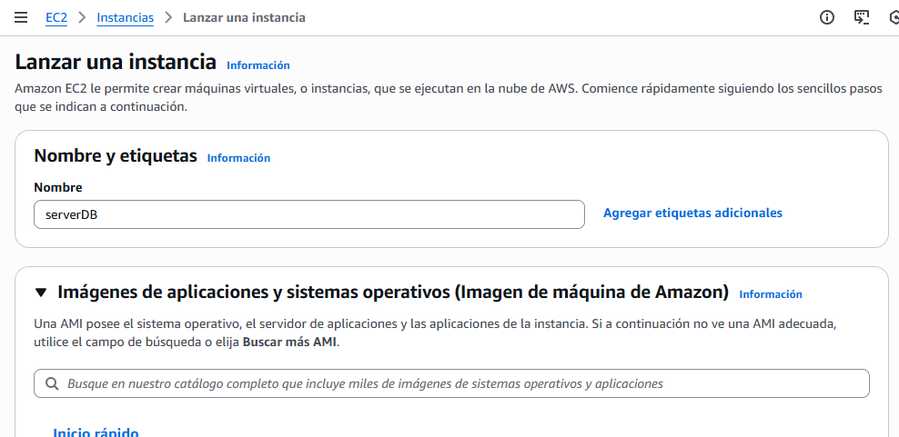

En el apartado Configuraciones de red, se selecciona la VPC, la subred para la instancia a crear y el grupo se seguridad creado.

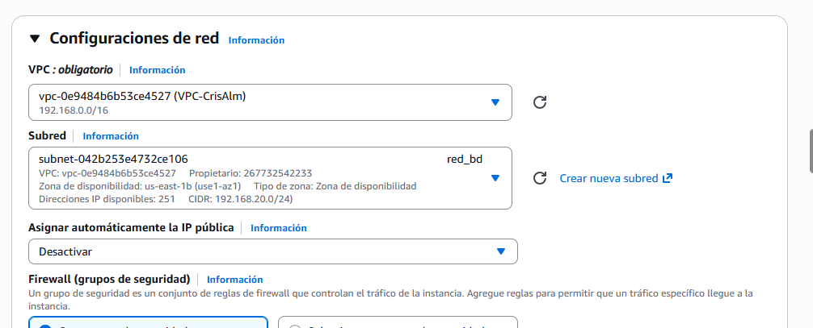

Se le asignan las direcciones IPs principales a cada interfaz de red.

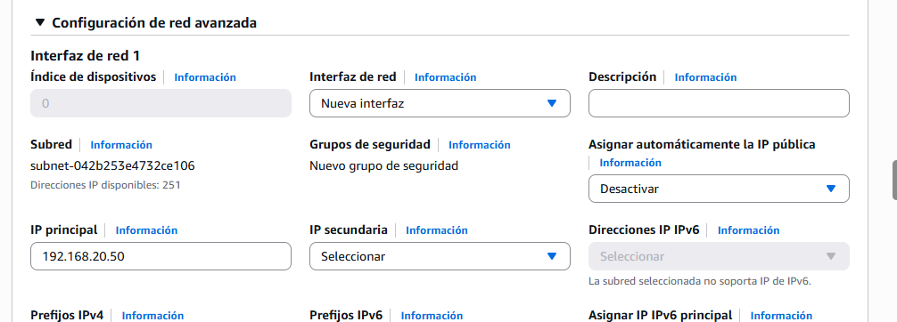

El script de aprovisionamiento se pega en **Datos de Usuario**.

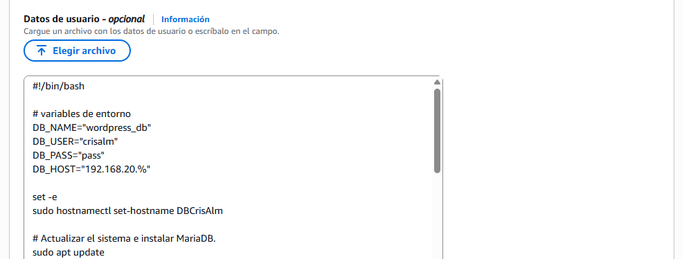

### 3.7\. Acceso público.

Es necesario asignar una IP Elástica (pública estática y reservada) asociada al balanceador. Esto garantiza que el punto de acceso público no cambie si la instancia se reinicia. Esta IP será la que se resgistre en un dominio público, `iawcris.ddns.net` en este caso.

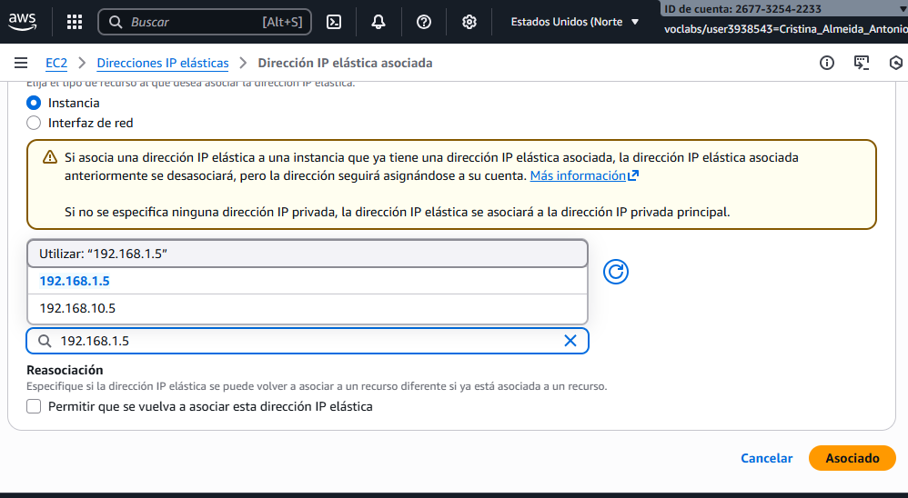

-----

## 4\. Comprobación y Uso.

El usuario final accede a la aplicación mediante el dominio configurado (`https://iawcris.ddns.net`). Así se comprueba la funcionalidad completa de WordPress, confirmando el balanceo de carga entre los dos servidores web y el correcto montaje del NFS.

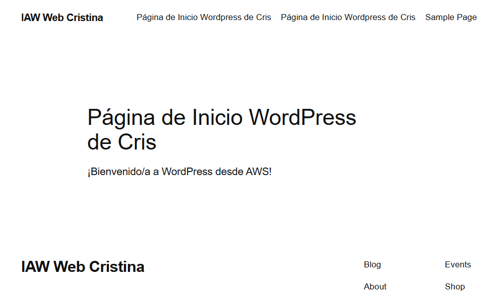

## 5\. Conclusión.

Se ha desplegado con éxito una arquitectura de WordPress de tres niveles en AWS, garantizando alta disponibilidad, cifrado de tráfico y un estricto aislamiento de red.
