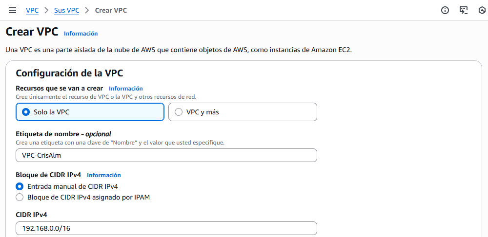
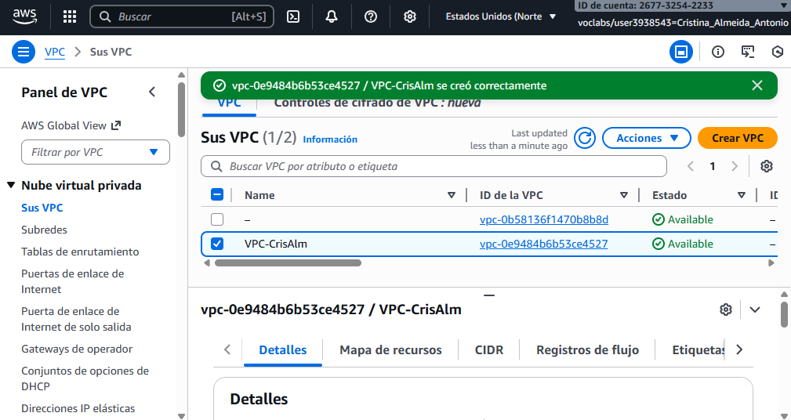
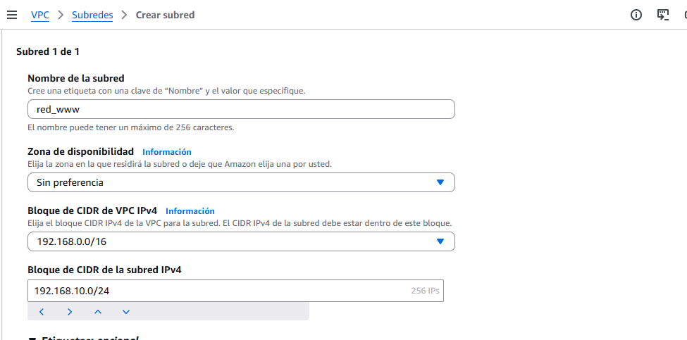
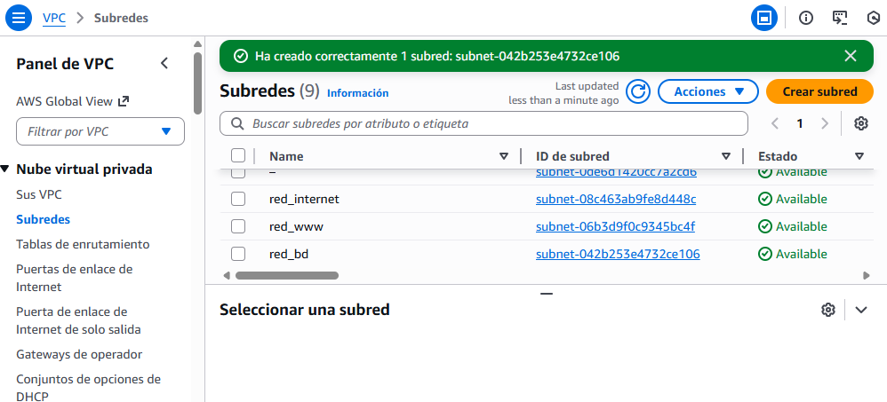
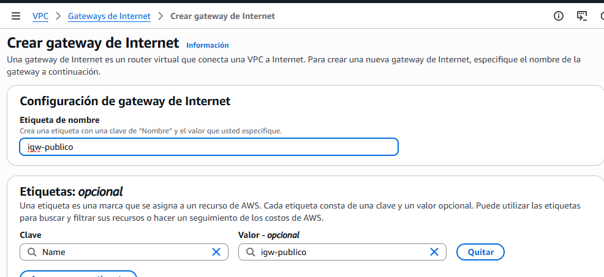
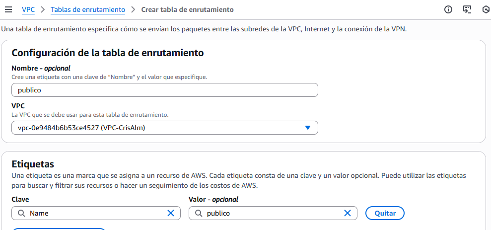
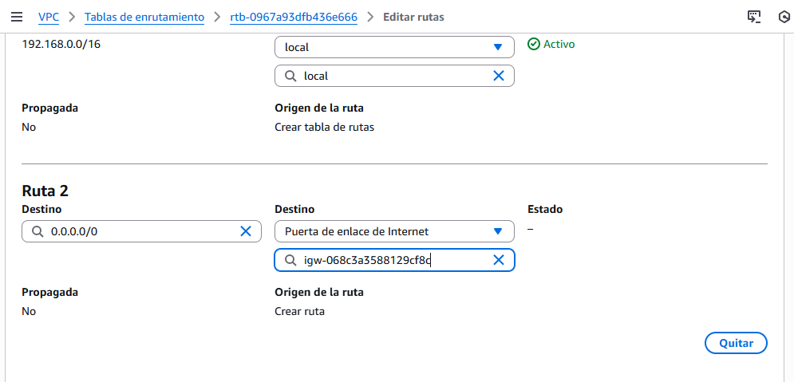

# Infraestructura de 3 Niveles en AWS
Infraestructura en 3 niveles: un balanceador, un cluster de dos servidores web, un servidor NFS, y un servidor de base de datos.

## Índice

* [1. Arquitectura](#1-arquitectura)
* [2. Script de Aprovisionamiento](#2-script-de-aprovisionamiento)
  * [2.1 Base de Datos](#41-base-de-datos)
  * [2.2 NFS](#42-NFS)
  * [2.3 Web](#43-web)
  * [2.4 Balanceador](#44-balanceador)
* [3. Configuración en AWS](#6-configuración-en-AWS)
* [6. Comprobación y Uso](#6-comprobación-y-uso)
* [7. Conclusión](#7-conclusión)
---

## 1\. Arquitectura.

La infraestructura se distribuye en cinco máquinas virtuales, creando varias capa de aislamientos esenciales para la seguridad.

| Máquina | Función | IP |
| --- | --- | --- |
| **BalanceadorCrisAlm** | Balanceador | `192.168.10.5` |
| **ServerWeb1CrisAlm** | Servidor Web | `192.168.10.10` `192.168.20.10` |
| **ServerWeb2CrisAlm** | Servidor Web | `192.168.10.20` `192.168.20.20`|
| **NFSCrisAlm** | Servidor NFS | `192.168.10.30` `192.168.20.30` |
| **BDCrisAlm** | Servidor de Base de Datos | `192.168.20.50` |
 
(explicar la red)

-----
    
## 2\. Script de Aprovisionamiento.

Cada instancia tendrá un script de aprovisionamiento para facilitar su configuración.

### 2.1\. Base de Datos.

En el script del servidor de base de datos, 

### 2.2\. NFS.

En el script del servidor de NFS, 

### 2.3\. Web.

En el script de los servidores web, 

### 2.4\. Balanceador.

En el script del servidor del balanceador, 

-----

## 3\. Configuración en AWS.

### 3.1\. Crear la VPC.

Una VPC (Virtual Private Cloud) es una red privada dentro de AWS.

Se le asigna un nombre y un espacio de red (Bloque CIDR IPv4).

### 3.2\. Crear las subredes.

Se crean tres subredes: una pública (balanceador) y dos privadas, una para los servidores web y otra para la base de datos.

A cada subred, se le asignan los siguientes parámetros: nombre, zona de disponibilidad y CIDR. 

### 3.3\. Configurar el Internet Gateway y Rutas.

Esto permite la comunicación entre tu VPC y el internet.

En Puertas de enlace a Internet, se crea un nueva puerta de enlace asignándole un nombre. Una vez creado, se asocia a la VPC creada anteriormente.

En Tablas de enrutamiento, se crea dándole un nombre y seleccionando la VPC. Después, en el caso de la subred pública, en Editar rutas, se añade la ruta por defecto hacia Internet, incluyendo la puerta de enlace. Las subredes privadas no tendrán salida a Internet.

A continuación, en Editar asociaciones, se asocia a la subred deseada.

### 3.5\. Configurar ACLs.

Un ACL actúa como un firewall que actúa sobre la subred, controlando el tráfico que entra y sale.

### 3.4\. Crear las instancias.

En el script del servidor de base de datos, 

### 3.5\. Crear la VPC.

En el script del servidor de base de datos, 

-----

## 6\. Comprobación y Uso.

## 7\. Conclusión.
