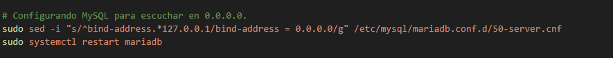
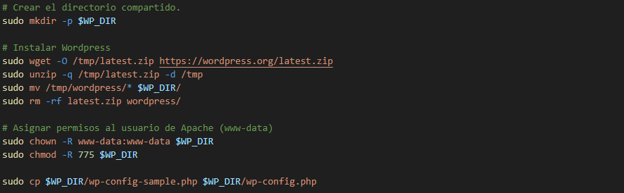
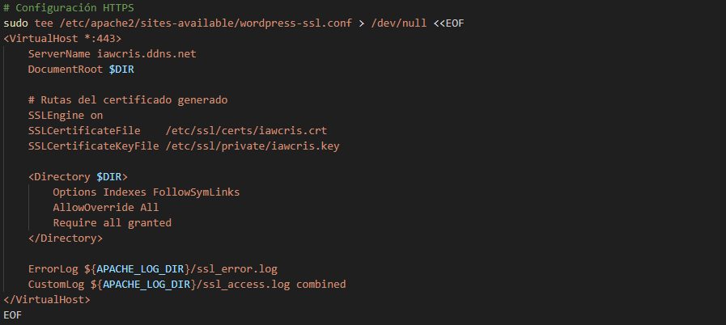
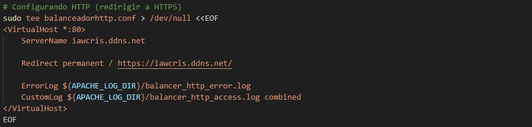

# Infraestructura de 3 Niveles en AWS
Infraestructura en 3 niveles: un balanceador, un cluster de dos servidores web, un servidor NFS, y un servidor de base de datos.

## Índice

* [1. Arquitectura](#1-arquitectura)
* [2. Requisitos Previos](#2-requisitos-previos)
* [3. Configuración](#3-configuración)
* [4. Script de Aprovisionamiento](#4-script-de-aprovisionamiento)
  * [4.1 Base de Datos](#41-base-de-datos)
  * [4.2 NFS](#42-NFS)
  * [4.3 Web](#43-web)
  * [4.4 Balanceador](#44-balanceador)
* [6. Comprobación y Uso](#6-comprobación-y-uso)
* [7. Conclusión](#7-conclusión)
---

## 1\. Arquitectura.

La infraestructura se distribuye en cinco máquinas virtuales, creando varias capa de aislamientos esenciales para la seguridad.

| Máquina | Función | IP |
| --- | --- | --- |
| **BalanceadorCrisAlm** | Balanceador | `192.168.10.5` |
| **ServerWeb1CrisAlm** | Servidor Web | `192.168.10.10` `192.168.20.10` |
| **ServerWeb2CrisAlm** | Servidor Web | `192.168.10.20` `192.168.20.20`|
| **NFSCrisAlm** | Servidor NFS | `192.168.10.30` `192.168.20.30` |
| **BDCrisAlm** | Servidor de Base de Datos | `192.168.20.50` |
 
(explicar la red)

-----

## 2\. Requisitos Previos.

-----

## 3\. Configuración.

-----
    
## 4\. Script de Aprovisionamiento.

Cada instancia tendrá un script de aprovisionamiento para facilitar su configuración.

### 4.1\. Base de Datos.

En el script del servidor de base de datos, 

### 4.2\. NFS.

En el script del servidor de NFS, 

### 4.3\. Web.

En el script de los servidores web, 

### 4.4\. Balanceador.

En el script del servidor del balanceador, 

-----

## 6\. Comprobación y Uso.

## 7\. Conclusión.
